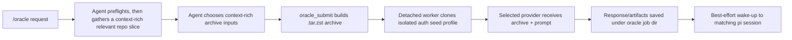

# pi-oracle

`pi-oracle` lets a `pi` agent send hard, long-running work to ChatGPT.com or Grok through the web app, with repo archives, background execution, saved results, and a best-effort wake-up back into `pi` when the answer is ready.

> Status: experimental public beta. Validated primarily on macOS with Google Chrome/Chromium and `pi` 0.65.0+. Normal oracle jobs run in an isolated browser profile, not your active browser window.

## What a successful run looks like

```text
You: /oracle Review the pending changes. Include the whole repo unless a narrower archive is clearly better.

pi-oracle:
  1. preflights local session/auth readiness
  2. builds a context-rich `.tar.zst` repo archive
  3. starts an isolated provider web runtime in the background
  4. uploads the archive and prompt to the selected provider
  5. saves the response/artifacts under /tmp/oracle-<job-id>/
  6. sends a best-effort wake-up back to the matching pi session

Later: /oracle-read <job-id>
```

What you are seeing: the local `pi` agent keeps control of context selection and safety checks, while the selected web provider handles the expensive second-opinion work asynchronously. If the wake-up is missed, the result still lives on disk and can be read by job id.

## Who this is for

Use `pi-oracle` if you use `pi` and want a larger asynchronous reviewer, planner, or analyst that can use your real ChatGPT or Grok web account instead of an API model.

It is most useful for:

- maintainers reviewing broad repo changes before shipping
- agents that need a slower second opinion without blocking the main `pi` turn
- migration, architecture, or failure-mode analysis that benefits from a large archive
- follow-up questions that should continue the same provider thread later

Do not use it for:

- short local coding tasks that `pi` can handle directly
- projects that must never be uploaded to ChatGPT.com, Grok, or another configured web provider
- non-macOS environments or machines without the required local browser/tooling

## Problem it solves

A normal coding-agent turn is the wrong shape for some work: the task may need a large repo snapshot, a slower web model, a real ChatGPT/Grok subscription, artifact downloads, or a durable result that arrives after the active turn ends.

`pi-oracle` makes that workflow explicit and recoverable instead of asking the main agent to manually drive provider chat UIs in your real browser window.

## What it does

| Problem | Capability | Proof in this repo |
| --- | --- | --- |
| Hard tasks need more context than a quick turn should gather. | `/oracle` prompts the agent to preflight, choose a context-rich archive, and submit it to the selected provider web app. | [`prompts/oracle.md`](prompts/oracle.md), `oracle_submit`, archive tests in `scripts/oracle-sanity-*` |
| Browser automation should not steal focus or mutate your active profile. | Jobs clone an authenticated seed profile into per-job isolated runtime profiles. | [`docs/ORACLE_DESIGN.md`](docs/ORACLE_DESIGN.md), [`extensions/oracle/lib/runtime.ts`](extensions/oracle/lib/runtime.ts) |
| Long jobs need durability. | Job state, responses, logs, and artifacts persist under `${PI_ORACLE_JOBS_DIR:-/tmp}/oracle-<job-id>/`. | [`extensions/oracle/lib/jobs.ts`](extensions/oracle/lib/jobs.ts), `/oracle-read`, `/oracle-status` |
| Provider auth can expire or drift. | `/oracle-auth [chatgpt|grok]` refreshes the isolated auth seed from a configured local Chromium profile, with recovery guidance. | [`extensions/oracle/lib/auth.ts`](extensions/oracle/lib/auth.ts), [`docs/ORACLE_RECOVERY_DRILL.md`](docs/ORACLE_RECOVERY_DRILL.md) |
| Agents need a simple API, not UI-driving instructions. | The package exposes agent-facing tools: `oracle_preflight`, `oracle_submit`, `oracle_read`, `oracle_auth`, and `oracle_cancel`. | [`extensions/oracle/lib/tools.ts`](extensions/oracle/lib/tools.ts) |

## Fastest way to see it work

### 1. Install

From npm:

```bash
pi install npm:pi-oracle
```

Or from GitHub:

```bash
pi install https://github.com/fitchmultz/pi-oracle
```

### 2. Check requirements

You need:

- macOS
- Node.js 22 or newer
- `pi` 0.65.0 or newer
- Google Chrome or another Chromium-family browser
- ChatGPT or Grok already signed in to the configured local browser profile for the provider you plan to use
- `agent-browser`, `tar`, and `zstd` available on the machine
- a normal persisted `pi` session, not `pi --no-session`

### 3. Sync provider auth once

```text
/oracle-auth
```

This reads cookies for the configured default provider from your local browser profile and writes an isolated oracle seed profile. Use `/oracle-auth grok` to force-refresh the Grok seed when your default provider is still ChatGPT. It should not automate your active browser window for normal jobs.

### 4. Submit a tiny job

```text
/oracle Read README.md and package.json. Tell me in five bullets what this package does and who should not use it.
```

Expected result:

- The `/oracle` prompt now runs an early oracle preflight before expensive repo reading or archive creation.
- The agent chooses a context-rich relevant archive up to the selected provider's upload ceiling, not the smallest possible one-file slice when nearby context helps.
- `oracle_submit` creates or queues a job.
- If local packing is too large, the prompt treats that as a retryable archive-selection failure and narrows automatically before surfacing the problem.
- The job uploads a repo archive to the selected provider, capped at 250 MiB for ChatGPT or 200 MiB for Grok after default exclusions/pruning.
- The response is saved under `/tmp/oracle-<job-id>/response.md` by default.
- The matching `pi` session gets one best-effort wake-up when the job finishes.

If the wake-up does not arrive, run:

```text
/oracle-status
/oracle-read <job-id>
```

## Example requests

```text
/oracle Review the current pending changes. Include the whole repo unless a narrower archive is clearly better. Give me a prioritized code review with concrete fixes.
```

```text
/oracle Read the codebase and explain the highest-risk auth/session failure modes, including what to test before shipping.
```

```text
/oracle Explain the README guidance for /oracle-clean retention grace. Archive README.md plus any nearby docs or implementation files that help answer accurately.
```

```text
/oracle-followup <job-id> Tighten the migration plan around rollback risk, and include the most relevant surrounding files/docs as long as the archive stays comfortably within the 250 MiB limit.
```

## How it works



Key design choices:

- **Prompt templates own context gathering.** `/oracle` and `/oracle-followup` tell the agent how to preflight, gather context, choose archive inputs, and then stop after dispatch.
- **Tools own execution.** `oracle_submit` builds the archive, admits or queues the job, starts the worker, and returns immediately.
- **Auth uses a seed profile.** `/oracle-auth` imports cookies into an isolated seed profile; each job clones that seed into its own temporary runtime profile.
- **Follow-ups preserve provider thread state.** `/oracle-followup <job-id> ...` resolves the prior job's saved provider URL and submits the next prompt with `followUpJobId`.
- **Wake-up is best effort, storage is durable.** A missed wake-up does not lose the result.

## Commands and tools

User-facing commands:

- `/oracle <request>` — prepare context and dispatch a ChatGPT or Grok web oracle job
- `/oracle-followup <job-id> <request>` — continue an earlier oracle job in the same provider thread
- `/oracle-auth [chatgpt|grok]` — sync provider cookies into the isolated oracle auth seed profile
- `/oracle-read [job-id]` — inspect job status and saved response preview
- `/oracle-status [job-id]` — inspect a job or list recent job ids when no explicit id is given
- `/oracle-cancel <job-id>` — cancel a queued or active job
- `/oracle-clean <job-id|all>` — remove temp files for terminal jobs; recently woken terminal jobs may stay retained briefly, and a blocked cleanup returns the next eligible cleanup time

Agent-facing tools:

- `oracle_preflight`
- `oracle_auth`
- `oracle_submit`
- `oracle_read`
- `oracle_cancel`

## Configuration

Most users can start with defaults. Set an agent-level config only when you need a non-default provider, mode, preset, or browser profile.

`~/.pi/agent/extensions/oracle.json`

```json
{
  "defaults": {
    "provider": "chatgpt",
    "preset": "<preset id from ORACLE_SUBMIT_PRESETS>",
    "grokMode": "expert"
  },
  "auth": {
    "chromeProfile": "Default"
  }
}
```

Notes:

- `defaults.provider` is the default web provider: `chatgpt` or `grok`.
- `defaults.preset` is the default ChatGPT model preset for oracle jobs.
- `defaults.grokMode` is the default Grok mode: `expert` (free) or `heavy` (requires SuperGrok Heavy subscription).
- The canonical preset ids and provider modes live in [`extensions/oracle/lib/config.ts`](extensions/oracle/lib/config.ts).
- If the packaged default is fine, omit `defaults`.
- When an agent is unsure which oracle preset fits, it should omit `preset` and use the configured default model instead of asking by default. If the prompt says to use Grok, it should pass `provider: "grok"` to `oracle_submit`.
- You usually do not need browser paths unless auto-detection fails.

### Custom Chromium cookie sources

Use this only for a Chromium-family browser that the default cookie importer cannot read.

Before running `/oracle-auth` with this path:

1. Log into ChatGPT or Grok in the target browser profile, depending on `defaults.provider`.
2. Fully quit the browser so its `Cookies` database is stable.
3. Find the profile `Cookies` SQLite DB path.
4. Find the browser's macOS Keychain safe-storage item account and service name.
5. Configure all of `browser.executablePath`, `auth.chromeCookiePath`, and `auth.chromiumKeychain` in `~/.pi/agent/extensions/oracle.json`.

Example Helium config:

```json
{
  "browser": {
    "executablePath": "/Applications/Helium.app/Contents/MacOS/Helium"
  },
  "auth": {
    "chromeProfile": "Default",
    "chromeCookiePath": "/Users/you/Library/Application Support/net.imput.helium/Default/Cookies",
    "chromiumKeychain": {
      "account": "Helium",
      "services": ["Helium Storage Key"],
      "label": "Helium Storage Key"
    }
  }
}
```

`auth.chromeCookiePath` must be paired with `auth.chromiumKeychain`; partial config is rejected so oracle does not silently fall back to another browser source.

## Available providers and presets

| Provider | Mode / preset | Upload ceiling |
| --- | --- | --- |
| ChatGPT | Presets below | 250 MiB |
| Grok | `expert` (free), `heavy` (paid) | 200 MiB |

Grok accepts the same `.tar.zst` archives that pi-oracle builds. Manual testing against `https://grok.com` found a 200 MiB file is accepted and a 200 MiB + 1 byte file is rejected, so pi-oracle caps Grok archives at 200 MiB.

## Available ChatGPT presets

| Preset id | Description |
| --- | --- |
| `pro_standard` | Pro - Standard |
| `pro_extended` | Pro - Extended |
| `thinking_light` | Thinking - Light |
| `thinking_standard` | Thinking - Standard |
| `thinking_extended` | Thinking - Extended |
| `thinking_heavy` | Thinking - Heavy |
| `instant` | Instant |
| `instant_auto_switch` | Instant - Auto-switch to Thinking Enabled |

For ChatGPT, `oracle_submit` accepts canonical preset ids or a matching human-readable preset label. Keep config values on canonical ids. For Grok, use `provider: "grok"`; supported modes are `expert` (free, default) and `heavy` (requires SuperGrok Heavy subscription).

## Outputs and cleanup

- Jobs persist response text, metadata, logs, and artifacts under `${PI_ORACLE_JOBS_DIR:-/tmp}/oracle-<job-id>/` by default.
- Jobs can queue automatically when runtime capacity is full.
- Completion delivery into `pi` is one-time best-effort wake-up based.
- `/oracle-read [job-id]` and `oracle_read({ jobId })` inspect saved output later.
- `/oracle-clean` removes terminal job temp files, but can briefly refuse cleanup after a wake-up so the follow-up turn can still read the saved paths.

## Privacy and local data

This extension is local-first, but it handles sensitive local and project data:

- `/oracle-auth` reads provider cookies from the configured local browser profile. Use `/oracle-auth grok` for Grok when ChatGPT remains the default provider.
- `oracle_submit` uploads selected project archives to the selected provider web app.
- Responses, logs, and artifacts are written to the configured oracle jobs directory.

Review the code and design docs before using it with private or regulated material.

## Current limits

- Experimental public beta, validated primarily on macOS.
- Provider UI, auth, model controls, and artifact download behavior can drift.
- Archive uploads are capped at 250 MiB for ChatGPT and 200 MiB for Grok after default exclusions and automatic whole-repo pruning.
- A real ChatGPT or Grok web session is required for the provider you use.
- The README currently uses command-level proof and design docs; no public screenshot or demo GIF is checked into the repo.
- Production hardening should keep focusing on UI drift detection, auth recovery, artifact capture, and environment diagnostics.

## Troubleshooting

### `/oracle-auth` fails or says login is required

- Make sure the selected provider works in the same local browser profile you configured.
- For custom Chromium cookie sources, confirm `auth.chromeCookiePath` points at that profile's `Cookies` DB and `auth.chromiumKeychain.services` names the browser's safe-storage Keychain service.
- Re-run `/oracle-auth`.
- Agent callers can use `oracle_auth({})` once before retrying a stale-auth oracle submission.
- If the provider is half-logged-in or challenge flow state looks weird, finish the login/challenge in the headed auth browser and retry.

### Custom Chromium auth says cookies synced but the session is rejected

This usually means the cookie import worked but the source cookies are not the active provider session you expected.

1. Open the configured browser profile.
2. Confirm the selected provider works there without logging in again.
3. Quit the browser fully so its `Cookies` DB is stable.
4. Confirm `auth.chromeCookiePath` points at that exact profile's `Cookies` DB.
5. Confirm `auth.chromiumKeychain.services` names the browser's safe-storage Keychain service for that DB.
6. Re-run `/oracle-auth`.

### You hit a challenge or verification page

- Solve it in the auth/bootstrap browser if prompted.
- Re-run `/oracle-auth` before submitting jobs again.

### You see "Oracle requires a persisted pi session"

- Do not run oracle from `pi --no-session`.
- Start a normal persisted `pi` session, then use `/oracle` again.

### A job finished but no wake-up arrived

- Use `/oracle-read [job-id]` to inspect the saved response preview.
- Use `/oracle-status` if you need help finding a recent job id.
- Agent callers can use `oracle_read({ jobId })`.
- Results are still saved on disk even if the reminder turn does not land.

### `/oracle-clean` refuses a terminal job right after completion

- This can happen during the short post-send retention grace window after a wake-up was sent.
- The command returns a `Retry after ...` timestamp when that guard is active.
- Wait until that time, then rerun `/oracle-clean <job-id|all>`.

### `agent-browser`, `tar`, or `zstd` is missing

Install the missing local dependency and rerun the command.

### Auto-detection picked the wrong browser profile

- Set `auth.chromeProfile` in `~/.pi/agent/extensions/oracle.json`.
- For custom Chromium cookie sources, set `auth.chromeCookiePath` to the exact profile `Cookies` DB and pair it with `auth.chromiumKeychain`.
- Re-run `/oracle-auth`.

### You want more details about a failed run

Inspect the job directory under `${PI_ORACLE_JOBS_DIR:-/tmp}/oracle-<job-id>/`. The worker log and captured diagnostics are stored there.

## Verification

Useful local checks:

```bash
npm run check:oracle-extension
npm run typecheck
npm run typecheck:worker-helpers
npm run sanity:oracle
npm run pack:check
npm test
npm run verify:oracle
```

`npm publish` is guarded by `prepublishOnly`, which runs `npm run verify:oracle`.

For end-to-end local-extension smoke testing, use [`docs/ORACLE_ISOLATED_PI_VALIDATION.md`](docs/ORACLE_ISOLATED_PI_VALIDATION.md). That workflow launches isolated `pi` sessions against this checkout and uses `instant` or `thinking_light`, as required by the project validation policy.

## Project map

| Path | Purpose |
| --- | --- |
| [`extensions/oracle/index.ts`](extensions/oracle/index.ts) | Extension entrypoint |
| `extensions/oracle/lib/` | Commands, tools, config, jobs, queueing, runtime, poller |
| `extensions/oracle/worker/` | Detached provider web worker and UI/auth helpers |
| `extensions/oracle/shared/` | Shared process, state, job, and observability helpers |
| [`prompts/oracle.md`](prompts/oracle.md) | `/oracle` prompt-template workflow |
| [`prompts/oracle-followup.md`](prompts/oracle-followup.md) | `/oracle-followup` prompt-template workflow |
| `scripts/oracle-sanity-*` | Local sanity and archive-safety checks |
| [`docs/ORACLE_DESIGN.md`](docs/ORACLE_DESIGN.md) | Architecture, lifecycle, queueing, persistence, recovery behavior |
| [`docs/ORACLE_ISOLATED_PI_VALIDATION.md`](docs/ORACLE_ISOLATED_PI_VALIDATION.md) | Repeatable isolated `pi` validation workflow |
| [`docs/ORACLE_RECOVERY_DRILL.md`](docs/ORACLE_RECOVERY_DRILL.md) | Safe expired-auth recovery drill |

## Next action

Install the package, run `/oracle-auth`, then submit the tiny README/package review job above. If you are evaluating the design before running it, start with [`docs/ORACLE_DESIGN.md`](docs/ORACLE_DESIGN.md).

## License

MIT. See `LICENSE`.
